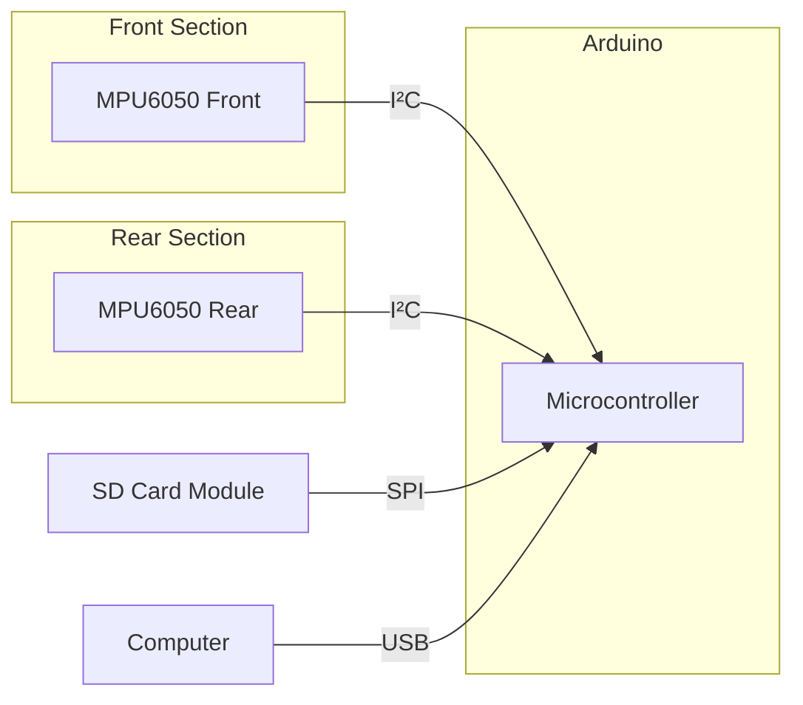

# Wiring Diagram for Eddy Current Braking Analysis System  
This document details the hardware connections for the accelerometer-based braking analysis system.  

---

## Core Components  
1. **Microcontroller**: Arduino Uno/Nano  
2. **Accelerometers**: Two MPU6050 modules (I²C)  
3. **Data Logging**: SD Card Module (SPI) *(Optional)*  
4. **Model Car**: Custom chassis with eddy current braking system  

---

## Connection Diagram  


---

## Pin-to-Pin Connections  
### Accelerometer Connections (Identical for both sensors)  

| Arduino Pin | MPU6050 Pin | Wire Color | Function         |  
|-------------|-------------|------------|------------------|  
| 5V          | VCC         | Red        | Power (3.3-5V)   |  
| GND         | GND         | Black      | Ground           |  
| A4 (SDA)    | SDA         | Blue       | I²C Data         |  
| A5 (SCL)    | SCL         | Yellow     | I²C Clock        |  
| -           | AD0         | -          | *Leave floating for front sensor* |  
| -           | AD0         | White      | *Connect to 5V for rear sensor* |  

> **Address Configuration**:  
> - Front sensor: AD0 floating → I²C address **0x68**  
> - Rear sensor: AD0 to 5V → I²C address **0x69**  

---

### SD Card Module Connections (Optional)  

| Arduino Pin | SD Module Pin | Wire Color | Function   |  
|-------------|--------------|------------|------------|  
| 5V          | VCC          | Red        | Power      |  
| GND         | GND          | Black      | Ground     |  
| D11         | MOSI         | Green      | SPI Data Out|  
| D12         | MISO         | Yellow     | SPI Data In |  
| D13         | SCK          | Blue       | SPI Clock  |  
| D10         | CS           | Orange     | Chip Select|  

---

## Physical Layout on Model Car  
```plaintext
   FRONT OF CAR
+-----------------+
|  [MPU6050]      |  <- Front sensor (0x68)
|    Z-axis ↑     |     (Measure initial impact)
|                 |
|                 |
|    Magnets      |  <- Eddy current brake
|                 |
|  [MPU6050]      |  <- Rear sensor (0x69)
|    Z-axis ↑     |     (Measure vibration decay)
+-----------------+
   REAR OF CAR
```

> **Orientation Notes**:  
> - Mount sensors with **Z-axis vertical** (perpendicular to car motion)  
> - Secure sensors with vibration-damping material  
> - Position front sensor near magnets for impact detection  

---

## Power Considerations  
1. **USB Power**:  
   - Use USB connection for lab testing  
   - Provides stable 5V for sensors  

2. **Battery Power**:  
   - 9V battery + voltage regulator for mobile experiments  
   - Add 100μF capacitor to smooth power fluctuations  

---

## Troubleshooting  
**Problem**: Sensors not detected  
**Solution**:  
1. Verify I²C addresses with I²C scanner sketch  
2. Check AD0 connection on rear sensor  
3. Ensure pull-up resistors (4.7kΩ) on SDA/SCL if using long wires  

**Problem**: Noisy measurements  
**Solution**:  
1. Separate power lines for motors and sensors  
2. Add ferrite beads to sensor power lines  
3. Use shielded cables for I²C connections  

---

## Example Setup Photos


> by [`jasmynkerstens`](https://www.instructables.com/member/jasmynkerstens/)

*Actual sensor placement on test vehicle*  

> **Next Steps**:  
> 1. Upload `accelerometer_reader.ino` to Arduino  
> 2. Open Processing visualization  
> 3. Run car down test track with magnets engaged  
```
