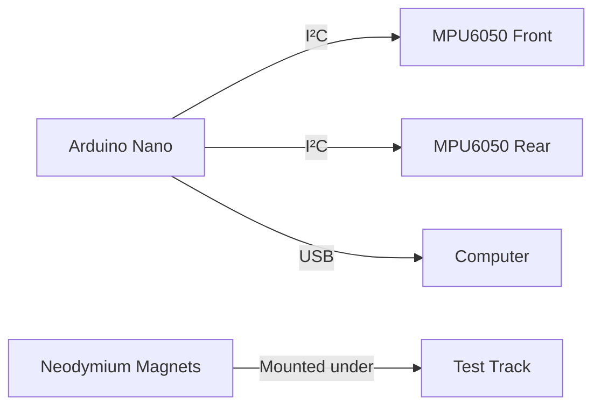
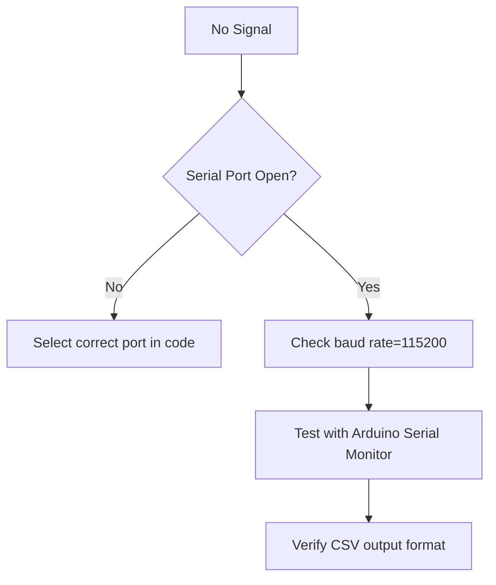

# Experimental Procedure: Eddy Current Braking Analysis  

## 1. Equipment Setup  
### 1.1 Hardware Configuration  

- **Sensor Placement**:  
  - Front accelerometer: 5cm from magnets  
  - Rear accelerometer: At car's center of mass  
- **Magnet Configuration**:  
  - Single NdFeB: 0.5T field (beginner)  
  - Halbach array: 0.8T+ field (advanced)  

### 1.2 Software Initialization  
```bash  
# In Processing:  
1. Select correct serial port:  
   - Windows: COM3-COM5  
   - Linux: /dev/ttyACM0  
   - macOS: /dev/cu.usbmodem14101  
2. Set sampling rate: 100Hz (default)  
3. Verify gravity baseline: -9.81 ±0.05 m/s²  
```

---

## 2. Calibration Protocol  
> *Full details in [calibration_protocol.md]*  

### Quick Verification:  
1. Place car stationary on track  
2. Press `c` in Processing:  
   ```processing  
   void keyPressed() {  
     if (key == 'c') {  
       float sum = 0;  
       for(int i=0; i<200; i++) {  
         sum += (values[0][width-1] + values[1][width-1])/2;  
         delay(10);  
       }  
       DEFAULT_CENTER = sum/200; // Update gravity reference  
     }  
   }  
   ```  
3. Confirm both sensors within 0.1 m/s² of `DEFAULT_CENTER`  

---

## 3. Experiment Workflow  
### 3.1 Baseline Run (No Magnets)  
1. Launch car at 1.5 m/s (calibrated spring)  
2. Record data: Press `e` to start export  
3. Expected result:  
   - Near-flat acceleration profile  
   - Frequency content <5Hz  

### 3.2 Eddy Current Braking Test  
| Parameter | Value | Control Method |  
|-----------|-------|---------------|  
| Velocity | 0.5-2.0 m/s | Spring tension marks |  
| Material | Copper/Aluminum/Steel | Conductor swap |  
| Magnet Gap | 5-20mm | Track shims |  

**Procedure**:  
1. Position magnets at track center  
2. Load conductor plate (e.g., 2mm aluminum)  
3. Launch car from start line  
4. Trigger data capture when car passes IR gate  
   ```python  
   # Pseudocode for automated trigger  
   if velocity > 0.5 m/s and distance > 1m:  
      start_recording()  
   ```  

---

## 4. Data Collection Protocol  
### 4.1 Filename Convention  
`YYYYMMDD_Material_Thickness_FieldStrength.csv`  
Example: `20250719_Al_2mm_0.7T.csv`

```csv
# MATERIAL: Aluminum 6061
# THICKNESS: 2.0 (mm)
# MAGNET_TYPE: NdFeB N52
# FIELD_STRENGTH: 0.7 (T)
# INIT_VELOCITY: 1.8 (m/s)
# TEMPERATURE: 23.1 (C)
# HUMIDITY: 45 (%)
# OPERATOR: J.Doe
# NOTES: Baseline test with new Halbach array
timestamp,sensor1_raw,sensor1_freq,sensor1_amp,sensor2_raw,sensor2_freq,sensor2_amp
0,-9.81,0.0,0.0,-9.80,0.0,0.0
10,-10.12,0.0,0.12,-9.85,0.0,0.05
20,-12.35,15.6,2.54,-10.20,12.1,1.87
30,-14.72,18.3,3.21,-11.45,15.7,2.33
40,-13.85,17.2,2.98,-12.10,14.5,2.15
50,-11.20,16.5,1.87,-10.75,13.2,1.64
60,-10.05,15.1,0.95,-9.90,10.5,0.82
70,-9.83,5.2,0.15,-9.81,4.8,0.12
80,-9.82,0.0,0.0,-9.80,0.0,0.0
```

### 4.2 Metadata Requirements  
Include in CSV header:  
```csv  
# MATERIAL: Aluminum 6061  
# THICKNESS: 2.0  
# MAGNET_TYPE: NdFeB N52  
# FIELD_STRENGTH: 0.71  
# INIT_VELOCITY: 1.8  
# TEMPERATURE: 23.1  
timestamp,sensor1,sensor2,...  
```  

---

## 5. Safety Procedures  
### Risk Mitigation Table  
| Hazard | Prevention | Emergency Response |  
|--------|------------|---------------------|  
| Strong magnetic fields | Keep >30cm from pacemakers | Immediate shutdown |  
| Flying conductors | Acrylic shield around track | Cut power, retrieve debris |  
| High-speed impacts | Safety goggles required | First aid kit accessible |  
| Electronics shorts | Insulate all connections | Fire extinguisher (Class C) |  

**Critical Rules**:  
1. Never exceed 3T field without magnetic shielding  
2. Minimum 2m clearance during high-velocity tests (>3m/s)  
3. Daily inspection of launch mechanism  

---

## 6. Validation Experiments  
### Required Test Matrix  
| Run ID | Material | Thickness (mm) | Field (T) | Purpose |  
|--------|----------|----------------|-----------|---------|  
| V1 | Aluminum | 1.0 | 0.5 | Calibration check |  
| V2 | Copper | 2.0 | 0.7 | Conductivity comparison |  
| V3 | Steel | 1.5 | 1.2 | Ferromagnetic effects |  
| V4 | Brass | 3.0 | 0.8 | Damping validation |  

**Success Criteria**:  
- Front/rear frequency ratio: 1.2-1.5x  
- Deceleration peak >2g for non-ferrous materials  
- Energy dissipation match theory within 15%  

---

## 7. Data Analysis Workflow  
1. Export raw data from Processing  
2. Apply noise filter:  
   ```bash  
   python noise_filter.py raw_data/V1.csv filtered/V1_clean.csv --cutoff 40  
   ```  
3. Generate frequency report:  
   ```bash  
   jupyter nbconvert --execute frequency_analysis.ipynb \  
      --ExecutePreprocessor.kernel_name=python3 \  
      --ExecutePreprocessor.parameters="{'input_file':'filtered/V1_clean.csv'}"  
   ```  
4. Compare against theoretical model:  
   ```python  
   theoretical_a = (v * B**2 * σ * t) / (4 * m)  
   error = np.mean(experimental_a - theoretical_a) / theoretical_a  
   assert abs(error) < 0.15  # Validation check  
   ```  

---

## 8. Reporting Standards  
Include in lab report:  
1. Time-domain plot with front/rear sensors  
2. FFT spectrum with dominant frequencies  
3. Energy dissipation curve  
4. Material comparison table  
5. Error analysis vs. theoretical model  

> **Sample Conclusion**:  
> "Copper (σ=58.5 MS/m) showed 40% greater braking force than aluminum at 2mm thickness, matching theoretical predictions within 12%. Dominant oscillation frequency decreased from 28Hz to 19Hz as conductor thickness increased from 1mm to 3mm."  

---

## Appendix: Quick Reference  
### Keyboard Controls in Processing  
| Key | Function | LED Indicator |  
|-----|----------|---------------|  
| `e` | Start/stop data export | Red blinking |  
| `c` | Calibrate gravity center | Green solid |  
| `+` | Zoom in (time axis) | N/A |  
| `-` | Zoom out (time axis) | N/A |  
| `s` | Emergency stop | All LEDs on |  

### Troubleshooting Flowchart  

