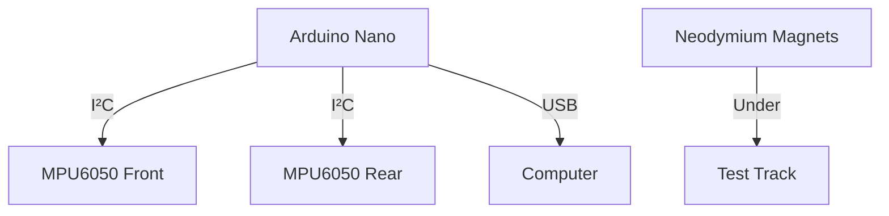
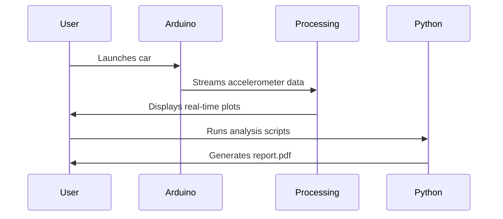

# BreakScope: Eddy Current Braking Analyzer

**Real-time visualization and analysis of electromagnetic braking dynamics** 

[](https://opensource.org/licenses/MIT)
[](https://www.python.org/downloads/)


## Features
- **Dual-sensor** acceleration monitoring (front/rear)
- **Real-time FFT** for frequency analysis
- **Material characterization** (Copper/Aluminum/Steel)
- **Export-ready** data formats (CSV, PNG)
- **Interactive controls** for zoom/filtering

## Hardware Setup


### Components
| Part | Specification |
|------|---------------|
| Microcontroller | Arduino Nano 33 IoT |
| Accelerometers | 2x MPU6050 (I²C addresses 0x68, 0x69) |
| Magnets | NdFeB N52, 10x10mm |
| Conductor Plates | Copper/Aluminum/Steel, 1-3mm thickness |

## Software Installation
1. **Firmware Upload**:
   ```bash
   cd Firmware/accelerometer_reader
   platformio run --target upload
   ```

2. **Processing Setup**:
   ```bash
   # Install required libraries
   git clone https://github.com/Customize5773/BrakeScope.git
   cd BrakeScope/Visualization
   ```

3. **Python Analysis Tools**:
   ```bash
   pip install -r Analysis_Tools/requirements.txt
   ```

## Quick Start
1. Connect Arduino via USB
2. Launch Processing sketch:
   ```processing
   BrakeScope.pde
   ```
3. Press `e` to start data recording
4. Press `s` to save screenshots

## Example Workflow


## Data Analysis
### Time-Domain
```python
python Analysis_Tools/braking_analysis.py exports/raw_data/20250719_run1.csv
```

### Frequency-Domain
```python
jupyter notebook Analysis_Tools/frequency_analysis.ipynb
```

## Calibration
1. Place car on level surface
2. Run calibration:
   ```processing
   Press 'c' in Processing window
   ```
3. Verify outputs:
   ```bash
   cat Visualization/data/calibration/mpu6050_front.cal
   ```

## Troubleshooting
| Symptom | Solution |
|---------|----------|
| No serial data | Check port number in `portNumber = 0` |
| High noise | Verify sensor mounting stability |
| Drifting baseline | Recalibrate with `key 'c'` |

## License
MIT License - See [LICENSE](LICENSE) for details
