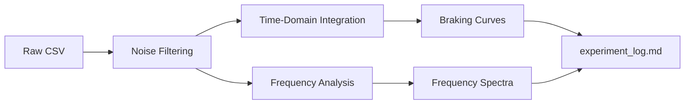

# Experimental Data Exports


This directory contains all data generated during live experiments and subsequent analysis. Files are automatically organized by processing stage.

---

## File Specifications

### 1. Raw Data (`raw_data/*.csv`)
**Format:**
```csv
timestamp,sensor1_raw,sensor1_freq,sensor1_amp,sensor2_raw,sensor2_freq,sensor2_amp
17000,-9.81,0.0,0.0,-9.80,0.0,0.0
17010,-10.12,0.0,0.12,-9.85,0.0,0.05
```

**Columns:**
- `timestamp`: Milliseconds since Arduino boot
- `sensorX_raw`: Unfiltered Z-acceleration (m/s²)
- `sensorX_freq`: Instantaneous oscillation frequency (Hz)
- `sensorX_amp`: Peak-to-peak amplitude (m/s²)

---

### 2. Processed Data (`processed/*.csv`)
#### Braking Curves
```csv
time,deceleration_front,deceleration_rear,velocity,energy_dissipated
0.00,0.00,0.00,1.80,0.00
0.01,0.15,0.05,1.79,0.03
```

#### Frequency Spectra  
```csv
frequency,amplitude_front,phase_front,amplitude_rear,phase_rear
0.0,0.000,0.0,0.000,0.0
5.0,0.015,12.5,0.012,10.2
```

---

## Naming Conventions
1. **Raw Data:**  
   `YYYYMMDD_runXX_description.csv`  
   Example: `20250719_run3_Al_2mm_0.7T.csv`

2. **Processed Data:**  
   `[analysis_type]_[material].csv`  
   Example: `braking_curves_copper.csv`

---

## Data Collection Protocol
1. **Live Capture:**
   ```processing
   // Press 'e' to start/stop recording
   void keyPressed() {
     if (key == 'e') toggleDataExport();
   }
   ```
2. **Automatic Metadata:**
   ```csv
   # MATERIAL: Aluminum 6061
   # THICKNESS: 2.0
   # FIELD_STRENGTH: 0.7
   ```

---

## Processing Pipeline


---

## Quality Control
1. **Validation Checks:**
   ```python
   # Verify energy conservation
   assert (initial_energy - final_energy) == dissipated_energy
   ```
2. **Anomaly Detection:**
   - Signal dropout >10ms
   - Frequency spikes >100Hz
   - Invalid gravity baseline (±0.5 m/s²)

---

## Usage Examples

### Python Analysis
```python
import pandas as pd

# Load processed data
df = pd.read_csv("exports/processed/braking_curves.csv")
peak_decel = df['deceleration_front'].max()
```

### MATLAB Visualization
```matlab
data = readtable('frequency_spectra.csv');
semilogx(data.frequency, data.amplitude_front);
xlabel('Frequency (Hz)'); 
ylabel('Amplitude (m/s²/√Hz)');
```

---

## Version Control Policy
| Directory | Tracked? | Retention |
|-----------|----------|-----------|
| `raw_data` | ❌ No | 30 days |
| `processed` | ✅ Yes | Indefinite |
| `experiment_log.md` | ✅ Yes | Indefinite |

> **Note:** Raw files over 50MB are automatically compressed (.gz)

---

## Maintenance
1. **Daily:** Verify free disk space (>10GB)
2. **Weekly:** Run `validate_exports.py` QC script
3. **Monthly:** Archive to cold storage

**Last System Check:** 2025-07-19  
**Maintainer:** [Customize5773]  
**License:** CC BY-NC-SA 4.0
